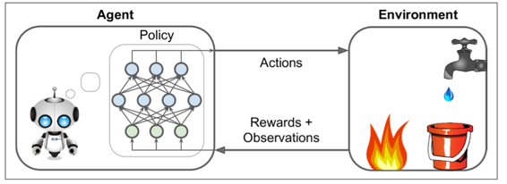
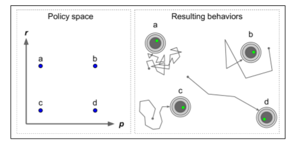
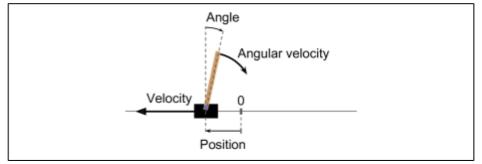
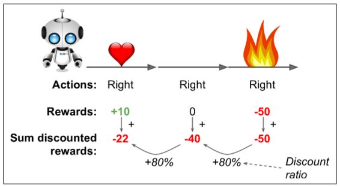
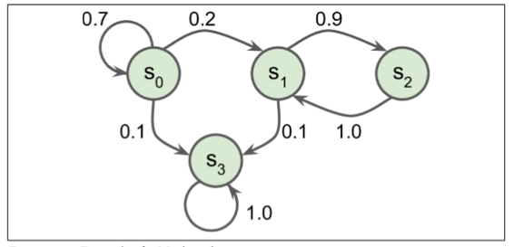
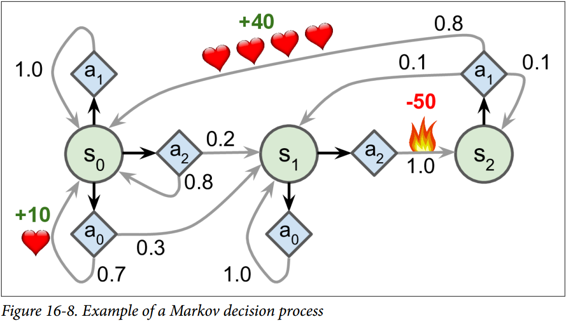
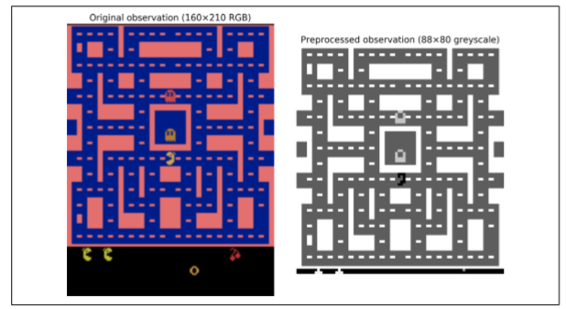
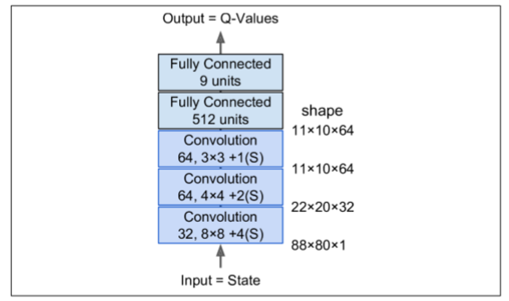

# 第16章 强化学习

强化学习（RL）如今是机器学习的一大令人激动的领域，当然之前也是。自从 1950 年被发明出来后，它在这些年产生了一些有趣的应用，尤其是在游戏（例如 TD-Gammon，一个西洋双陆棋程序）和及其控制领域，但是从未弄出什么大新闻。直到 2013 年一个革命性的发展：来自英国的研究者发起了一项 Deepmind 项目，这个项目可以学习去玩任何从头开始的 Atari 游戏，甚至多数比人类玩的还要好，它仅使用像素作为输入而没有使用游戏规则的任何先验知识。这是一系列令人惊叹的壮举中的第一个，并在 2016 年 3 月以他们的系统阿尔法狗战胜了世界围棋冠军李世石而告终。从未有程序能勉强打败这个游戏的大师，更不用说世界冠军了。今天，RL 的整个领域正在沸腾着新的想法，其都具有广泛的应用范围。DeepMind 在 2014 被谷歌以超过 5 亿美元收购。

那么他们是怎么做到的呢？事后看来，原理似乎相当简单：他们将深度学习运用到强化学习领域，结果却超越了他们最疯狂的设想。在本章中，我们将首先解释强化学习是什么，以及它擅长于什么，然后我们将介绍两个在深度强化学习领域最重要的技术：策略梯度和深度 Q 网络（DQN），包括讨论马尔可夫决策过程（MDP）。我们将使用这些技术来训练一个模型来平衡移动车上的杆子，另一个玩 Atari 游戏。同样的技术可以用于各种各样的任务，从步行机器人到自动驾驶汽车。

## 学习优化奖励

在强化学习中，智能体在环境（environment）中观察（observation）并且做出决策（action），随后它会得到奖励（reward）。它的目标是去学习如何行动能最大化**期望奖励**。如果你不在意去拟人化的话，你可以认为正奖励是愉快，负奖励是痛苦（这样的话奖励一词就有点误导了）。简单来说，智能体在环境中行动，并且在实验和错误中去学习最大化它的愉快，最小化它的痛苦。

这是一个相当广泛的设置，可以适用于各种各样的任务。以下是几个例子（详见图 16-1）：

1.  智能体可以是控制一个机械狗的程序。在此例中，环境就是真实的世界，智能体通过许多的传感器例如摄像机或者传感器来观察，它可以通过给电机发送信号来行动。它可以被编程设置为如果到达了目的地就得到正奖励，如果浪费时间，或者走错方向，或摔倒了就得到负奖励。
2.  智能体可以是控制 MS.Pac-Man 的程序。在此例中，环境是 Atari 游戏的仿真，行为是 9 个操纵杆位（上下左右中间等等），观察是屏幕，回报就是游戏点数。
3.  相似地，智能体也可以是棋盘游戏的程序例如：围棋。
4.  智能体也可以不用去控制一个实体（或虚拟的）去移动。例如它可以是一个智能程序，当它调整到目标温度以节能时会得到正奖励，当人们需要自己去调节温度时它会得到负奖励，所以智能体必须学会预见人们的需要。
5.  智能体也可以去观测股票市场价格以实时决定买卖。奖励的依据显然为挣钱或者赔钱。


其实没有正奖励也是可以的，例如智能体在迷宫内移动，它每分每秒都得到一个负奖励，所以它要尽可能快的找到出口！还有很多适合强化学习的领域，例如自动驾驶汽车，在网页上放广告，或者控制一个图像分类系统让它明白它应该关注于什么。

## 策略搜索

被智能体使用去改变它行为的算法叫做策略。例如，策略可以是一个把观测当输入，行为当做输出的神经网络（见图16-2）。



这个策略可以是你能想到的任何算法，它甚至可以不被确定。举个例子，例如，考虑一个真空吸尘器，它的奖励是在 30 分钟内捡起的灰尘数量。它的策略可以是每秒以概率`P`向前移动，或者以概率`1-P`随机地向左或向右旋转。旋转角度将是`-R`和`+R`之间的随机角度，因为该策略涉及一些随机性，所以称为随机策略。机器人将有一个不确定的轨迹，它保证它最终会到达任何可以到达的地方，并捡起所有的灰尘。问题是：30分钟后它会捡起多少灰尘？

你怎么训练这样的机器人？你可以调整两个策略参数：概率`P`和角度范围`R`。一个想法是这些参数尝试许多不同的值，并选择执行最佳的组合（见图 16-3）。这是一个策略搜索的例子，在这种情况下使用野蛮的方法。然而，当策略空间太大（通常情况下），以这样的方式找到一组好的参数就像是大海捞针。



另一种搜寻策略空间的方法是遗传算法。例如你可以随机创造一个包含 100 个策略的第一代基因，随后杀死 80 个糟糕的策略，随后让 20 个幸存策略繁衍 4 代。一个后代只是它父辈基因的复制品加上一些随机变异。幸存的策略加上他们的后代共同构成了第二代。你可以继续以这种方式迭代代，直到找到一个好的策略。

另一种方法是使用优化技术，通过评估奖励关于策略参数的梯度，然后通过跟随梯度向更高的奖励（梯度上升）调整这些参数。这种方法被称为策略梯度（policy gradient, PG），我们将在本章后面详细讨论。例如，回到真空吸尘器机器人，你可以稍微增加概率P并评估这是否增加了机器人在 30 分钟内拾起的灰尘的量；如果确实增加了，就相对应增加`P`，否则减少`P`。我们将使用 Tensorflow 来实现 PG 算法，但是在这之前我们需要为智能体创造一个生存的环境，所以现在是介绍 OpenAI 的时候了。

## OpenAI 的介绍

强化学习的一个挑战是，为了训练智能体，首先需要有一个工作环境。如果你想设计一个可以学习 Atari 游戏的程序，你需要一个 Atari 游戏模拟器。如果你想设计一个步行机器人，那么环境就是真实的世界，你可以直接在这个环境中训练你的机器人，但是这有其局限性：如果机器人从悬崖上掉下来，你不能仅仅点击“撤消”。你也不能加快时间；增加更多的计算能力不会让机器人移动得更快。一般来说，同时训练 1000 个机器人是非常昂贵的。简而言之，训练在现实世界中是困难和缓慢的，所以你通常需要一个模拟环境，至少需要引导训练。

OpenAI gym 是一个工具包，它提供各种各样的模拟环境（Atari 游戏，棋盘游戏，2D 和 3D 物理模拟等等），所以你可以训练，比较，或开发新的 RL 算法。

让我们安装 OpenAI gym。可通过`pip`安装：

```bash
$ pip install --upgrade gym
```

接下来打开 Python shell 或 Jupyter 笔记本创建您的第一个环境：

```python
>>> import gym 
>>> env = gym.make("CartPole-v0") 
[2016-10-14 16:03:23,199] Making new env: MsPacman-v0 
>>> obs = env.reset() 
>>> obs 
array([-0.03799846,-0.03288115,0.02337094,0.00720711]) 
>>> env.render() 
```

使用`make()`函数创建一个环境，在此例中是 CartPole 环境。这是一个 2D 模拟，其中推车可以被左右加速，以平衡放置在它上面的平衡杆（见图 16-4）。在创建环境之后，我们需要使用`reset()`初始化。这会返回第一个观察结果。观察取决于环境的类型。对于 CartPole 环境，每个观测是包含四个浮点的 1D Numpy 向量：这些浮点数代表推车的水平位置（0 为中心）、其速度、杆的角度（0 维垂直）及其角速度。最后，`render()`方法显示如图 16-4 所示的环境。



如果你想让`render()`让图像以一个 NUMPY 数组格式返回，可以将`mode`参数设置为`rgb_array`（注意其他环境可能支持不同的模式）：

```python
>>> img = env.render(mode="rgb_array") 
>>> img.shape  # height, width, channels (3=RGB) 
(400, 600, 3)
```

不幸的是，即使将`mode`参数设置为`rgb_array`，CartPole（和其他一些环境）还是会将将图像呈现到屏幕上。避免这种情况的唯一方式是使用一个 fake X 服务器，如 XVFB 或 XDimMy。例如，可以使用以下命令安装 XVFB 和启动 Python：`xvfb-run -s "screen 0 1400x900x24" python`。或者使用`xvfbwrapper`包。

让我们来询问环境什么动作是可能的：

```python
>>> env.action_space 
Discrete(2)
```

`Discrete(2)`表示可能的动作是整数 0 和 1，表示向左（0）或右（1）的加速。其他环境可能有更多的动作，或者其他类型的动作（例如，连续的）。因为杆子向右倾斜，让我们向右加速推车：

```python
>>> action = 1  # accelerate right 
>>> obs, reward, done, info = env.step(action) 
>>> obs 
array([-0.03865608,  0.16189797,  0.02351508, -0.27801135]) 
>>> reward 
1.0 
>>> done 
False 
>>> info 
{} 
```

`step()`表示执行给定的动作并返回四个值：

`obs`:

这是新的观测，小车现在正在向右走（`obs[1]>0`，注：当前速度为正，向右为正）。平衡杆仍然向右倾斜（`obs[2]>0`），但是他的角速度现在为负（`obs[3]<0`），所以它在下一步后可能会向左倾斜。

`reward`：

在这个环境中，无论你做什么，每一步都会得到 1.0 奖励，所以游戏的目标就是尽可能长的运行。

`done`：

当游戏结束时这个值会为`True`。当平衡杆倾斜太多时会发生这种情况。之后，必须重新设置环境才能重新使用。

`info`：

该字典可以在其他环境中提供额外的调试信息。这些数据不应该用于训练（这是作弊）。

让我们硬编码一个简单的策略，当杆向左倾斜时加速左边，当杆向右倾斜时加速。我们使用这个策略来获得超过 500 步的平均回报：

```python
def basic_policy(obs):    
    angle = obs[2]    
    return 0 if angle < 0 else 1

totals = [] 
for episode in range(500):    
    episode_rewards = 0    
    obs = env.reset()    
    for step in range(1000): # 最多1000 步，我们不想让它永远运行下去        
        action = basic_policy(obs)        
        obs, reward, done, info = env.step(action)        
        episode_rewards += reward        
        if done:            
            break    
    totals.append(episode_rewards)
```

这个代码希望能自我解释。让我们看看结果：

```python
>>> import numpy as np 
>>> np.mean(totals), np.std(totals), np.min(totals), np.max(totals) 
(42.125999999999998, 9.1237121830974033, 24.0, 68.0)
```

即使有 500 次尝试，这一策略从未使平衡杆在超过 68 个连续的步骤里保持直立。这不太好。如果你看一下 Juyter Notebook 中的模拟，你会发现，推车越来越强烈地左右摆动，直到平衡杆倾斜太多。让我们看看神经网络是否能提出更好的策略。

## 神经网络策略

让我们创建一个神经网络策略。就像之前我们编码的策略一样，这个神经网络将把观察作为输入，输出要执行的动作。更确切地说，它将估计每个动作的概率，然后我们将根据估计的概率随机地选择一个动作（见图 16-5）。在 CartPole 环境中，只有两种可能的动作（左或右），所以我们只需要一个输出神经元。它将输出动作 0（左）的概率`p`，动作 1（右）的概率显然将是`1 - p`。

例如，如果它输出 0.7，那么我们将以 70% 的概率选择动作 0，以 30% 的概率选择动作 1。


你可能奇怪为什么我们根据神经网络给出的概率来选择随机的动作，而不是选择最高分数的动作。这种方法使智能体在**探索新的行为**和**利用那些已知可行的行动**之间找到正确的平衡。举个例子：假设你第一次去餐馆，所有的菜看起来同样吸引人，所以你随机挑选一个。如果菜好吃，你可以增加下一次点它的概率，但是你不应该把这个概率提高到 100%，否则你将永远不会尝试其他菜肴，其中一些甚至比你尝试的更好。

还要注意，在这个特定的环境中，过去的动作和观察可以被安全地忽略，因为每个观察都包含环境的完整状态。如果有一些隐藏状态，那么你也需要考虑过去的行为和观察。例如，如果环境仅仅揭示了推车的位置，而不是它的速度，那么你不仅要考虑当前的观测，还要考虑先前的观测，以便估计当前的速度。另一个例子是当观测是有噪声的的，在这种情况下，通常你想用过去的观察来估计最可能的当前状态。因此，CartPole 问题是简单的；观测是无噪声的，而且它们包含环境的全状态。

```python
import tensorflow as tf 
from tensorflow.contrib.layers import fully_connected
# 1. 声明神经网络结构 
n_inputs = 4  # == env.observation_space.shape[0] 
n_hidden = 4  # 这只是个简单的测试，不需要过多的隐藏层
n_outputs = 1 # 只输出向左加速的概率
initializer = tf.contrib.layers.variance_scaling_initializer()
# 2. 建立神经网络 
X = tf.placeholder(tf.float32, shape=[None, n_inputs]) hidden = fully_connected(X, n_hidden, activation_fn=tf.nn.elu,weights_initializer=initializer) # 隐层激活函数使用指数线性函数                
logits = fully_connected(hidden, n_outputs, activation_fn=None,weights_initializer=initializer)                   
outputs = tf.nn.sigmoid(logits)
# 3. 在概率基础上随机选择动作
p_left_and_right = tf.concat(axis=1, values=[outputs, 1 - outputs]) 
action = tf.multinomial(tf.log(p_left_and_right), num_samples=1)
init = tf.global_variables_initializer() 
```

让我们通读代码：

1.  在导入之后，我们定义了神经网络体系结构。输入的数量是观测空间的大小（在 CartPole 的情况下是 4 个），我们只有 4 个隐藏单元，并且不需要更多，并且我们只有 1 个输出概率（向左的概率）。

2.  接下来我们构建了神经网络。在这个例子中，它是一个 vanilla 多层感知器，只有一个输出。注意，输出层使用 Logistic（Sigmoid）激活函数，以便输出从 0 到 1 的概率。如果有两个以上的可能动作，每个动作都会有一个输出神经元，相应的你将使用 Softmax 激活函数。

3.  最后，我们调用`multinomial()`函数来选择一个随机动作。该函数独立地采样一个（或多个）整数，给定每个整数的对数概率。例如，如果通过设置`num_samples=5`，令数组为`[np.log(0.5), np.log(0.2), np.log(0.3)]`来调用它，那么它将输出五个整数，每个整数都有 50% 的概率是 0，20% 为 1，30% 为 2。在我们的情况下，我们只需要一个整数来表示要采取的行动。由于输出张量（output）仅包含向左的概率，所以我们必须首先将 1 - output 连接它，以得到包含左和右动作的概率的张量。请注意，如果有两个以上的可能动作，神经网络将不得不输出每个动作的概率，这时你就不需要连接步骤了。

好了，现在我们有一个可以观察和输出动作的神经网络了，那我们怎么训练它呢？

## 评价行为：信用分配问题

如果我们知道每一步的最佳动作，我们可以像通常一样训练神经网络，通过最小化估计概率和目标概率之间的交叉熵。这只是通常的监督学习。然而，在强化学习中，智能体获得的指导的唯一途径是通过奖励，奖励通常是稀疏的和延迟的。例如，如果智能体在 100 个步骤内设法平衡杆，它怎么知道它采取的 100 个行动中的哪一个是好的，哪些是坏的？它所知道的是，在最后一次行动之后，杆子坠落了，但最后一次行动肯定不是完全负责的。这被称为信用分配问题：当智能体得到奖励时，很难知道哪些行为应该被信任（或责备）。想想一只狗在行为良好后几小时就会得到奖励，它会明白它得到了什么回报吗？

为了解决这个问题，一个通常的策略是基于这个动作后得分的总和来评估这个个动作，通常在每个步骤中应用衰减率`r`。例如（见图 16-6），如果一个智能体决定连续三次向右，在第一步之后得到 +10 奖励，第二步后得到 0，最后在第三步之后得到 -50，然后假设我们使用衰减率`r=0.8`，那么第一个动作将得到`10 +r×0 + r2×(-50)=-22`的分述。如果衰减率接近 0，那么与即时奖励相比，未来的奖励不会有多大意义。相反，如果衰减率接近 1，那么对未来的奖励几乎等于即时回报。典型的衰减率通常为是 0.95 或 0.99。如果衰减率为 0.95，那么未来 13 步的奖励大约是即时奖励的一半（`0.9513×0.5`），而当衰减率为 0.99，未来 69 步的奖励是即时奖励的一半。在 CartPole 环境下，行为具有相当短期的影响，因此选择 0.95 的折扣率是合理的。



当然，一个好的动作可能会伴随着一些坏的动作，这些动作会导致平衡杆迅速下降，从而导致一个好的动作得到一个低分数（类似的，一个好行动者有时会在一部烂片中扮演主角）。然而，如果我们花足够多的时间来训练游戏，平均下来好的行为会得到比坏的更好的分数。因此，为了获得相当可靠的动作分数，我们必须运行很多次并将所有动作分数归一化（通过减去平均值并除以标准偏差）。之后，我们可以合理地假设消极得分的行为是坏的，而积极得分的行为是好的。现在我们有一个方法来评估每一个动作，我们已经准备好使用策略梯度来训练我们的第一个智能体。让我们看看如何。

## 策略梯度

正如前面所讨论的，PG 算法通过遵循更高回报的梯度来优化策略参数。一种流行的 PG 算法，称为增强算法，在 1929 由 Ronald Williams 提出。这是一个常见的变体：

1.  首先，让神经网络策略玩几次游戏，并在每一步计算梯度，这使得智能体更可能选择行为，但不应用这些梯度。

2.  运行几次后，计算每个动作的得分（使用前面段落中描述的方法）。

3.  如果一个动作的分数是正的，这意味着动作是好的，可应用较早计算的梯度，以便将来有更大的的概率选择这个动作。但是，如果分数是负的，这意味着动作是坏的，要应用负梯度来使得这个动作在将来采取的可能性更低。我们的方法就是简单地将每个梯度向量乘以相应的动作得分。

4.  最后，计算所有得到的梯度向量的平均值，并使用它来执行梯度下降步骤。

让我们使用 TensorFlow 实现这个算法。我们将训练我们早先建立的神经网络策略，让它学会平衡车上的平衡杆。让我们从完成之前编码的构造阶段开始，添加目标概率、代价函数和训练操作。因为我们的意愿是选择的动作是最好的动作，如果选择的动作是动作 0（左），则目标概率必须为 1，如果选择动作 1（右）则目标概率为 0：

```python
y = 1. - tf.to_float(action) 
```

现在我们有一个目标概率，我们可以定义损失函数（交叉熵）并计算梯度：

```python
learning_rate = 0.01
cross_entropy = tf.nn.sigmoid_cross_entropy_with_logits(                    labels=y, logits=logits) 
optimizer = tf.train.AdamOptimizer(learning_rate) 
grads_and_vars = optimizer.compute_gradients(cross_entropy)
```

注意，我们正在调用优化器的`compute_gradients()`方法，而不是`minimize()`方法。这是因为我们想要在使用它们之前调整梯度。`compute_gradients()`方法返回梯度向量/变量对的列表（每个可训练变量一对）。让我们把所有的梯度放在一个列表中，以便方便地获得它们的值：

```python
gradients = [grad for grad, variable in grads_and_vars] 
```

好，现在是棘手的部分。在执行阶段，算法将运行策略，并在每个步骤中评估这些梯度张量并存储它们的值。在多次运行之后，它如先前所解释的调整这些梯度（即，通过动作分数乘以它们并使它们归一化），并计算调整后的梯度的平均值。接下来，需要将结果梯度反馈到优化器，以便它可以执行优化步骤。这意味着对于每一个梯度向量我们需要一个占位符。此外，我们必须创建操作去应用更新的梯度。为此，我们将调用优化器的`apply_gradients()`函数，该函数接受梯度向量/变量对的列表。我们不给它原始的梯度向量，而是给它一个包含更新梯度的列表（即，通过占位符递送的梯度）：

```python
gradient_placeholders = [] 
grads_and_vars_feed = [] 
for grad, variable in grads_and_vars:       
    gradient_placeholder = tf.placeholder(tf.float32, shape=grad.get_shape())    
    gradient_placeholders.append(gradient_placeholder)  
    grads_and_vars_feed.append((gradient_placeholder, variable))
training_op = optimizer.apply_gradients(grads_and_vars_feed) 
```

让我们后退一步，看看整个运行过程：

```python
n_inputs = 4 
n_hidden = 4 
n_outputs = 1 
initializer = tf.contrib.layers.variance_scaling_initializer()

learning_rate = 0.01
X = tf.placeholder(tf.float32, shape=[None, n_inputs]) 
hidden = fully_connected(X, n_hidden, activation_fn=tf.nn.elu,weights_initializer=initializer)                          
logits = fully_connected(hidden, n_outputs, activation_fn=None,                    weights_initializer=initializer) 
outputs = tf.nn.sigmoid(logits) 
p_left_and_right = tf.concat(axis=1, values=[outputs, 1 - outputs]) 
action = tf.multinomial(tf.log(p_left_and_right), num_samples=1)

y = 1. - tf.to_float(action) 
cross_entropy = tf.nn.sigmoid_cross_entropy_with_logits(labels=y, logits=logits) 
optimizer = tf.train.AdamOptimizer(learning_rate) 
grads_and_vars = optimizer.compute_gradients(cross_entropy) 
gradients = [grad for grad, variable in grads_and_vars] 
gradient_placeholders = [] 
grads_and_vars_feed = [] 
for grad, variable in grads_and_vars:    
gradient_placeholder = tf.placeholder(tf.float32, shape=grad.get_shape())    gradient_placeholders.append(gradient_placeholder)    
grads_and_vars_feed.append((gradient_placeholder, variable)) 
training_op = optimizer.apply_gradients(grads_and_vars_feed)

init = tf.global_variables_initializer() 
saver = tf.train.Saver()
```

到执行阶段了！我们将需要两个函数来计算总折扣奖励，给予原始奖励，以及归一化多次循环的结果：

```python
def discount_rewards(rewards, discount_rate):    
    discounted_rewards = np.empty(len(rewards))    
    cumulative_rewards = 0    
    for step in reversed(range(len(rewards))):        
        cumulative_rewards = rewards[step] + cumulative_rewards * discount_rate       discounted_rewards[step] = cumulative_rewards    
    return discounted_rewards

def discount_and_normalize_rewards(all_rewards, discount_rate):       
    all_discounted_rewards = [discount_rewards(rewards) for rewards in all_rewards]       
    flat_rewards = np.concatenate(all_discounted_rewards)    
    reward_mean = flat_rewards.mean()    
    reward_std = flat_rewards.std()    
    return [(discounted_rewards - reward_mean)/reward_std  for discounted_rewards in all_discounted_rewards] 
```

让我们检查一下运行的如何：

```python
>>> discount_rewards([10, 0, -50], discount_rate=0.8) 
array([-22., -40., -50.]) 
>>> discount_and_normalize_rewards([[10, 0, -50], [10, 20]], discount_rate=0.8) 
[array([-0.28435071, -0.86597718, -1.18910299]), array([ 1.26665318,  1.0727777 ])] 
```

对`discount_rewards()`的调用正好返回我们所期望的（见图 16-6）。你也可以验证函数`iscount_and_normalize_rewards()`确实返回了两个步骤中每个动作的标准化分数。注意第一步比第二步差很多，所以它的归一化分数都是负的；从第一步开始的所有动作都会被认为是坏的，反之，第二步的所有动作都会被认为是好的。

我们现在有了训练策略所需的一切：

```python
n_iterations = 250      # 训练迭代次数 
n_max_steps = 1000      # 每一次的最大步长 
n_games_per_update = 10 # 每迭代十次训练一次策略网络 
save_iterations = 10    # 每十次迭代保存模型
discount_rate = 0.95
with tf.Session() as sess:    
    init.run()    
    for iteration in range(n_iterations):        
        all_rewards = []    #每一次的所有奖励        
        all_gradients = []  #每一次的所有梯度        
        for game in range(n_games_per_update):            
            current_rewards = []   #当前步的所有奖励        
            current_gradients = [] #当前步的所有梯度 
            obs = env.reset()            
            for step in range(n_max_steps):                
                action_val, gradients_val = sess.run([action, gradients],
                feed_dict={X: obs.reshape(1, n_inputs)}) # 一个obs                
                obs, reward, done, info = env.step(action_val[0][0])                current_rewards.append(reward)                
                current_gradients.append(gradients_val)                
                if done:                    
                    break            
                all_rewards.append(current_rewards)            
                all_gradients.append(current_gradients)
        # 此时我们每10次运行一次策略，我们已经准备好使用之前描述的算法去更新策略，注：即使用迭代10次的结果来优化当前的策略。      
        all_rewards = discount_and_normalize_rewards(all_rewards)        
        feed_dict = {}        
        for var_index, grad_placeholder in enumerate(gradient_placeholders):
            # 将梯度与行为分数相乘，并计算平均值
            mean_gradients = np.mean([reward * all_gradients[game_index][step][var_index] for game_index, rewards in enumerate(all_rewards)  for step, reward in enumerate(rewards)],axis=0)            
            feed_dict[grad_placeholder] = mean_gradients        
        sess.run(training_op, feed_dict=feed_dict)  
        if iteration % save_iterations == 0:           
            saver.save(sess, "./my_policy_net_pg.ckpt")
```

每一次训练迭代都是通过运行10次的策略开始的（每次最多 1000 步，以避免永远运行）。在每一步，我们也计算梯度，假设选择的行动是最好的。在运行了这 10 次之后，我们使用`discount_and_normalize_rewards()`函数计算动作得分；我们遍历每个可训练变量，在所有次数和所有步骤中，通过其相应的动作分数来乘以每个梯度向量；并且我们计算结果的平均值。最后，我们运行训练操作，给它提供平均梯度（对每个可训练变量提供一个）。我们继续每 10 个训练次数保存一次模型。

我们做完了！这段代码将训练神经网络策略，它将成功地学会平衡车上的平衡杆（你可以在 Juyter notebook 上试用）。注意，实际上有两种方法可以让玩家游戏结束：要么平衡可以倾斜太大，要么车完全脱离屏幕。在 250 次训练迭代中，策略学会平衡极点，但在避免脱离屏幕方面还不够好。额外数百次的训练迭代可以解决这一问题。

研究人员试图找到一种即使当智能体最初对环境一无所知时也能很好地工作的算法。然而，除非你正在写论文，否则你应该尽可能多地将先前的知识注入到智能体中，因为它会极大地加速训练。例如，你可以添加与屏幕中心距离和极点角度成正比的负奖励。此外，如果你已经有一个相当好的策略，你可以训练神经网络模仿它，然后使用策略梯度来改进它。

尽管它相对简单，但是该算法是非常强大的。你可以用它来解决更难的问题，而不仅仅是平衡一辆手推车上的平衡杆。事实上，AlgPaGo 是基于类似的 PG 算法（加上蒙特卡罗树搜索，这超出了本书的范围）。

现在我们来看看另一个流行的算法。与 PG 算法直接尝试优化策略以增加奖励相反，我们现在看的算法是间接的：智能体学习去估计每个状态的未来衰减奖励的期望总和，或者在每个状态中的每个行为未来衰减奖励的期望和。然后，使用这些知识来决定如何行动。为了理解这些算法，我们必须首先介绍马尔可夫决策过程（MDP）。

## 马尔可夫决策过程

在二十世纪初，数学家 Andrey Markov 研究了没有记忆的随机过程，称为马尔可夫链。这样的过程具有固定数量的状态，并且在每个步骤中随机地从一个状态演化到另一个状态。它从状态`S`演变为状态`S'`的概率是固定的，它只依赖于`(S, S')`对，而不是依赖于过去的状态（系统没有记忆）。

图 16-7 展示了一个具有四个状态的马尔可夫链的例子。假设该过程从状态`S0`开始，并且在下一步骤中有 70% 的概率保持在该状态不变中。最终，它必然离开那个状态，并且永远不会回来，因为没有其他状态回到`S0`。如果它进入状态`S1`，那么它很可能会进入状态`S2`（90% 的概率），然后立即回到状态`S1`（以 100% 的概率）。它可以在这两个状态之间交替多次，但最终它会落入状态`S3`并永远留在那里（这是一个终端状态）。马尔可夫链可以有非常不同的应用，它们在热力学、化学、统计学等方面有着广泛的应用。



马尔可夫决策过程最初是在 20 世纪 50 年代由 Richard Bellman 描述的。它们类似于马尔可夫链，但有一个连结：**在状态转移的每一步中，一个智能体可以选择几种可能的动作中的一个，并且转移概率取决于所选择的动作。**此外，一些状态转移返回一些奖励（正或负），智能体的目标是找到一个策略，随着时间的推移将最大限度地提高奖励。

例如，图 16-8 中所示的 MDP 在每个步骤中具有三个状态和三个可能的离散动作。如果从状态`S0`开始，随着时间的推移可以在动作`A0`、`A1`或`A2`之间进行选择。如果它选择动作`A1`，它就保持在状态`S0`中，并且没有任何奖励。因此，如果愿意的话，它可以决定永远呆在那里。但是，如果它选择动作`A0`，它有 70% 的概率获得 10 奖励，并保持在状态`S0`。然后，它可以一次又一次地尝试获得尽可能多的奖励。但它将在状态`S1`中结束这样的行为。在状态`S1`中，它只有两种可能的动作：`A0`或`A1`。它可以通过反复选择动作`A1`来选择停留，或者它可以选择动作`A2`移动到状态`S2`并得到 -50 奖励。在状态`S3`中，除了采取行动`A1`之外，别无选择，这将最有可能引导它回到状态`S0`，在途中获得 40 的奖励。通过观察这个 MDP，你能猜出哪一个策略会随着时间的推移而获得最大的回报吗？在状态`S0`中，清楚地知道`A0`是最好的选择，在状态`S3`中，智能体别无选择，只能采取行动`A1`，但是在状态`S1`中，智能体否应该保持不动（`A0`）或通过火（`A2`），这是不明确的。



Bellman 找到了一种估计任何状态`S`的最佳状态值的方法，他提出了`V(s)`，它是智能体在其采取最佳行为达到状态`s`后所有衰减未来奖励的总和的平均期望。他表明，如果智能体的行为最佳，那么贝尔曼最优性公式适用（见公式 16-1）。这个递归公式表示，如果智能体最优地运行，那么当前状态的最优值等于在采取一个最优动作之后平均得到的奖励，加上该动作可能导致的所有可能的下一个状态的期望最优值。


其中：

+   `T`为智能体选择动作`a`时从状态`s`到状态`s'`的概率

+   `R`为智能体选择以动作`a`从状态`s`到状态`s'`的过程中得到的奖励

+   $\gamma$为衰减率

这个等式直接引出了一种算法，该算法可以精确估计每个可能状态的最优状态值：首先将所有状态值估计初始化为零，然后用数值迭代算法迭代更新它们（见公式 16-2）。一个显著的结果是，给定足够的时间，这些估计保证收敛到最优状态值，对应于最优策略。


其中：

+   $V_k (s)$是在`k`次算法迭代对状态`s`的估计

该算法是动态规划的一个例子，它将了一个复杂的问题（在这种情况下，估计潜在的未来衰减奖励的总和）变为可处理的子问题，可以迭代地处理（在这种情况下，找到最大化平均报酬与下一个衰减状态值的和的动作）

了解最佳状态值可能是有用的，特别是评估策略，但它没有明确地告诉智能体要做什么。幸运的是，Bellman 发现了一种非常类似的算法来估计最优状态-动作值（*state-action values*），通常称为 Q 值。状态行动`(S, A)`对的最优 Q 值，记为`Q(s, a)`，是智能体在到达状态`S`，然后选择动作`A`之后平均衰减未来奖励的期望的总和。但是在它看到这个动作的结果之前，假设它在该动作之后的动作是最优的。

下面是它的工作原理：再次，通过初始化所有的 Q 值估计为零，然后使用 Q 值迭代算法更新它们（参见公式 16-3）。


一旦你有了最佳的 Q 值，定义最优的策略`π*(s)`，它是平凡的：当智能体处于状态`S`时，它应该选择具有最高 Q 值的动作，用于该状态：$\pi ^ * (s) =\arg \max_a Q^*(s, a)$。

让我们把这个算法应用到图 16-8 所示的 MDP 中。首先，我们需要定义 MDP：

```python
nan=np.nan  # 代表不可能的动作 
T = np.array([  # shape=[s, a, s']        
    [[0.7, 0.3, 0.0], [1.0, 0.0, 0.0], [0.8, 0.2, 0.0]],
    [[0.0, 1.0, 0.0], [nan, nan, nan], [0.0, 0.0, 1.0]],       
    [[nan, nan, nan], [0.8, 0.1, 0.1], [nan, nan, nan]],    ]) 
R = np.array([  # shape=[s, a, s']        
    [[10., 0.0, 0.0], [0.0, 0.0, 0.0], [0.0, 0.0, 0.0]],        
    [[10., 0.0, 0.0], [nan, nan, nan], [0.0, 0.0, -50.]],        
    [[nan, nan, nan], [40., 0.0, 0.0], [nan, nan, nan]],    ]) 
possible_actions = [[0, 1, 2], [0, 2], [1]] 
```

让我们运行 Q 值迭代算法

```python
Q = np.full((3, 3), -np.inf)  # -inf 对应着不可能的动作 
for state, actions in enumerate(possible_actions):    
    Q[state, actions] = 0.0  # 对所有可能的动作初始化为0.0
learning_rate = 0.01 
discount_rate = 0.95 
n_iterations = 100
for iteration in range(n_iterations):   
    Q_prev = Q.copy()    
    for s in range(3):        
        for a in possible_actions[s]:            
            Q[s, a] = np.sum([T[s, a, sp] * (R[s, a, sp] + discount_rate * np.max(Q_prev[sp]))  
            for sp in range(3)]) 
```

结果的 Q 值类似于如下：

```python
>>> Q 
array([[ 21.89498982,  20.80024033,  16.86353093],       
        [  1.11669335,         -inf,   1.17573546],       
        [        -inf,  53.86946068,         -inf]]) 
>>> np.argmax(Q, axis=1)  # 每一状态的最优动作
array([0, 2, 1]) 
```

这给我们这个 MDP 的最佳策略，当使用 0.95 的衰减率时：在状态`S0`选择动作`A0`，在状态`S1`选择动作`A2`（通过火焰！）在状态`S2`中选择动作`A1`（唯一可能的动作）。有趣的是，如果你把衰减率降低到 0.9，最优的策略改变：在状态`S1`中，最好的动作变成`A0`（保持不变；不通过火）。这是有道理的，因为如果你认为现在比未来更重要，那么未来奖励的前景是不值得立刻经历痛苦的。

## 时间差分学习与 Q 学习

具有离散动作的强化学习问题通常可以被建模为马尔可夫决策过程，但是智能体最初不知道转移概率是什么（它不知道`T`），并且它不知道奖励会是什么（它不知道`R`）。它必须经历每一个状态和每一次转变并且至少知道一次奖励，并且如果要对转移概率进行合理的估计，就必须经历多次。

时间差分学习（TD 学习）算法与数值迭代算法非常类似，但考虑到智能体仅具有 MDP 的部分知识。一般来说，我们假设智能体最初只知道可能的状态和动作，没有更多了。智能体使用探索策略，例如，纯粹的随机策略来探索 MDP，并且随着它的发展，TD 学习算法基于实际观察到的转换和奖励来更新状态值的估计（见公式 16-4）。


其中：

`a`是学习率（例如 0.01）

TD 学习与随机梯度下降有许多相似之处，特别是它一次处理一个样本的行为。就像 SGD 一样，只有当你逐渐降低学习速率时，它才能真正收敛（否则它将在极值点震荡）。

对于每个状态`S`，该算法只跟踪智能体离开该状态时立即获得的奖励的平均值，再加上它期望稍后得到的奖励（假设它的行为最佳）。

类似地，此时的Q 学习算法是 Q 值迭代算法的改编版本，其适应转移概率和回报在初始未知的情况（见公式16-5）。


对于每一个状态动作对`(s,a)`，该算法跟踪智能体在以动作`A`离开状态`S`时获得的即时奖励平均值`R`，加上它期望稍后得到的奖励。由于目标策略将最优地运行，所以我们取下一状态的 Q 值估计的最大值。

以下是如何实现 Q 学习：

```python
import numpy.random as rnd
learning_rate0 = 0.05 
learning_rate_decay = 0.1 
n_iterations = 20000
s = 0 # 在状态 0开始
Q = np.full((3, 3), -np.inf)  # -inf 对应着不可能的动作 
for state, actions in enumerate(possible_actions):    
    Q[state, actions] = 0.0  # 对于所有可能的动作初始化为 0.0
for iteration in range(n_iterations):    
    a = rnd.choice(possible_actions[s])  # 随机选择动作   
    sp = rnd.choice(range(3), p=T[s, a]) # 使用 T[s, a] 挑选下一状态   
    reward = R[s, a, sp]    
    learning_rate = learning_rate0 / (1 + iteration * learning_rate_decay)    
    Q[s, a] = learning_rate * Q[s, a] + (1 - learning_rate) * (reward + discount_rate * np.max(Q[sp]))    
    s = sp # 移动至下一状态
```

给定足够的迭代，该算法将收敛到最优 Q 值。这被称为离线策略算法，因为正在训练的策略不是正在执行的策略。令人惊讶的是，该算法能够通过观察智能体行为随机学习（例如学习当你的老师是一个醉猴子时打高尔夫球）最佳策略。我们能做得更好吗？

## 探索策略

当然，只有在探索策略充分探索 MDP 的情况下，Q 学习才能起作用。尽管一个纯粹的随机策略保证最终访问每一个状态和每个转换多次，但可能需要很长的时间这样做。因此，一个更好的选择是使用 ε 贪婪策略：在每个步骤中，它以概率`ε`随机地或以概率为`1-ε`贪婪地（选择具有最高 Q 值的动作）。ε 贪婪策略的优点（与完全随机策略相比）是，它将花费越来越多的时间来探索环境中有趣的部分，因为 Q 值估计越来越好，同时仍花费一些时间访问 MDP 的未知区域。以`ε`为很高的值（例如，1）开始，然后逐渐减小它（例如，下降到 0.05）是很常见的。

可选择的，相比于依赖于探索的可能性，另一种方法是鼓励探索策略来尝试它以前没有尝试过的行动。这可以被实现为附加于 Q 值估计的奖金，如公式 16-6 所示。


其中：

+   `N`计算了在状态`s`时选择动作`a`的次数

+   `f`是一个探索函数，例如`f=q+K/(1+n)`，其中`K`是一个好奇超参数，它测量智能体被吸引到未知状态的程度。

## 近似 Q 学习

Q 学习的主要问题是，它不能很好地扩展到具有许多状态和动作的大（甚至中等）的 MDP。试着用 Q 学习来训练一个智能体去玩 Ms. Pac-Man。Ms. Pac-Man 可以吃超过 250 粒粒子，每一粒都可以存在或不存在（即已经吃过）。因此，可能状态的数目大于 2 的 250 次幂，约等于 10 的 75 次幂（并且这是考虑颗粒的可能状态）。这比在可观测的宇宙中的原子要多得多，所以你绝对无法追踪每一个 Q 值的估计值。

解决方案是找到一个函数，使用可管理数量的参数来近似 Q 值。这被称为近似 Q 学习。多年来，人们都是手工在状态中提取并线性组合特征（例如，最近的鬼的距离，它们的方向等）来估计 Q 值，但是 DeepMind 表明使用深度神经网络可以工作得更好，特别是对于复杂的问题。它不需要任何特征工程。用于估计 Q 值的 DNN 被称为深度 Q 网络（DQN），并且使用近似 Q 学习的 DQN 被称为深度 Q 学习。

在本章的剩余部分，我们将使用深度 Q 学习来训练一个智能体去玩 Ms. Pac-Man，就像 DeepMind 在 2013 所做的那样。代码可以很容易地调整，调整后学习去玩大多数 Atari 游戏的效果都相当好。在大多数动作游戏中，它可以达到超人的技能，但它在长时运行的游戏中却不太好。

## 学习去使用深度 Q 学习来玩 Ms.Pac-Man

由于我们将使用 Atari 环境，我们必须首先安装 OpenAI gym 的 Atari 环境依赖项。当需要玩其他的时候，我们也会为你想玩的其他 OpenAI gym 环境安装依赖项。在 macOS 上，假设你已经安装了 Homebrew 程序，你需要运行：

```
$ brew install cmake boost boost-python sdl2 swig wget
```

在 Ubuntu 上，输入以下命令（如果使用 Python 2，用 Python 替换 Python 3）：

```
$ apt-get install -y python3-numpy python3-dev cmake zlib1g-dev libjpeg-dev\    xvfb libav-tools xorg-dev python3-opengl libboost-all-dev libsdl2-dev swig 
```

随后安装额外的 python 包：

```
$ pip3 install --upgrade 'gym[all]' 
```

如果一切顺利，你应该能够创造一个 Ms.Pac-Man 环境：

```python
>>> env = gym.make("MsPacman-v0") 
>>> obs = env.reset() 
>>> obs.shape  # [长，宽，通道] 
(210, 160, 3) 
>>> env.action_space 
Discrete(9) 
```

正如你所看到的，有九个离散动作可用，它对应于操纵杆的九个可能位置（左、右、上、下、中、左上等），观察结果是 Atari 屏幕的截图（见图 16-9，左），表示为 3D Numpy 矩阵。这些图像有点大，所以我们将创建一个小的预处理函数，将图像裁剪并缩小到`88×80`像素，将其转换成灰度，并提高 Ms.Pac-Man 的对比度。这将减少 DQN 所需的计算量，并加快培训练。

```python
mspacman_color = np.array([210, 164, 74]).mean()

def preprocess_observation(obs):    
    img = obs[1:176:2, ::2] # 裁剪    
    img = img.mean(axis=2) # 灰度化    
    img[img==mspacman_color] = 0 # 提升对比度    
    img = (img - 128) / 128 - 1 # 正则化为-1到1.   
    return img.reshape(88, 80, 1) 
```

过程的结果如图 16-9 所示（右）。



接下来，让我们创建 DQN。它可以只取一个状态动作对`(S,A)`作为输入，并输出相应的 Q 值`Q(s,a)`的估计值，但是由于动作是离散的，所以使用只使用状态`S`作为输入并输出每个动作的一个 Q 值估计的神经网络是更方便的。DQN 将由三个卷积层组成，接着是两个全连接层，其中包括输出层（如图 16-10）。



正如我们将看到的，我们将使用的训练算法需要两个具有相同架构（但不同参数）的 DQN：一个将在训练期间用于驱动 Ms.Pac-Man（the *actor*，行动者），另一个将观看行动者并从其试验和错误中学习（the *critic*，评判者）。每隔一定时间，我们把评判者网络复制给行动者网络。因为我们需要两个相同的 DQN，所以我们将创建一个`q_network()`函数来构建它们：

```python
from tensorflow.contrib.layers import convolution2d, fully_connected
input_height = 88 
input_width = 80 
input_channels = 1 
conv_n_maps = [32, 64, 64] 
conv_kernel_sizes = [(8,8), (4,4), (3,3)] 
conv_strides = [4, 2, 1] 
conv_paddings = ["SAME"]*3 
conv_activation = [tf.nn.relu]*3 
n_hidden_in = 64 * 11 * 10  # conv3 有 64 个 11x10 映射
each n_hidden = 512 
hidden_activation = tf.nn.relu 
n_outputs = env.action_space.n  # 9个离散动作
initializer = tf.contrib.layers.variance_scaling_initializer()

def q_network(X_state, scope):    
    prev_layer = X_state    
    conv_layers = []    
    with tf.variable_scope(scope) as scope:        
        for n_maps, kernel_size, stride, padding, activation in zip(conv_n_maps,                                                                  conv_kernel_sizes, 
                                                                    conv_strides,
                                                                    conv_paddings,                                                                  conv_activation):           
            prev_layer = convolution2d(prev_layer, 
                                       num_outputs=n_maps, 
                                       kernel_size=kernel_size,
                                       stride=stride, padding=padding, 
                                       activation_fn=activation,
                                       weights_initializer=initializer)           
            conv_layers.append(prev_layer)       
        last_conv_layer_flat = tf.reshape(prev_layer, shape=[-1, n_hidden_in])     
        hidden = fully_connected(last_conv_layer_flat, n_hidden,
                                 activation_fn=hidden_activation,                                                  weights_initializer=initializer) 
        outputs = fully_connected(hidden, n_outputs, 
                                  activation_fn=None,
                                  weights_initializer=initializer)  
        
    trainable_vars = tf.get_collection(tf.GraphKeys.TRAINABLE_VARIABLES,
                                       scope=scope.name)                
    trainable_vars_by_name = {var.name[len(scope.name):]: var 
                              for var in trainable_vars}    
    return outputs, trainable_vars_by_name
```

该代码的第一部分定义了DQN体系结构的超参数。然后`q_network()`函数创建 DQN，将环境的状态`X_state`作为输入，以及变量范围的名称。请注意，我们将只使用一个观察来表示环境的状态，因为几乎没有隐藏的状态（除了闪烁的物体和鬼魂的方向）。

`trainable_vars_by_name`字典收集了所有 DQN 的可训练变量。当我们创建操作以将评论家 DQN 复制到行动者 DQN 时，这将是有用的。字典的键是变量的名称，去掉与范围名称相对应的前缀的一部分。看起来像这样：

```python
>>> trainable_vars_by_name 
{'/Conv/biases:0': <tensorflow.python.ops.variables.Variable at 0x121cf7b50>, '/Conv/weights:0': <tensorflow.python.ops.variables.Variable...>, 
'/Conv_1/biases:0': <tensorflow.python.ops.variables.Variable...>, '/Conv_1/weights:0': <tensorflow.python.ops.variables.Variable...>, '/Conv_2/biases:0': <tensorflow.python.ops.variables.Variable...>, '/Conv_2/weights:0': <tensorflow.python.ops.variables.Variable...>, '/fully_connected/biases:0': <tensorflow.python.ops.variables.Variable...>, '/fully_connected/weights:0': <tensorflow.python.ops.variables.Variable...>, '/fully_connected_1/biases:0': <tensorflow.python.ops.variables.Variable...>, '/fully_connected_1/weights:0': <tensorflow.python.ops.variables.Variable...>}
```

现在让我们为两个 DQN 创建输入占位符，以及复制评论家 DQN 给行动者 DQN 的操作：

```python
X_state = tf.placeholder(tf.float32, 
                         shape=[None, input_height, input_width,input_channels])          
actor_q_values, actor_vars = q_network(X_state, scope="q_networks/actor") 
critic_q_values, critic_vars = q_network(X_state, scope="q_networks/critic")
copy_ops = [actor_var.assign(critic_vars[var_name])  
            for var_name, actor_var in actor_vars.items()] 
copy_critic_to_actor = tf.group(*copy_ops) 
```

让我们后退一步：我们现在有两个 DQN，它们都能够将环境状态（即预处理观察）作为输入，并输出在该状态下的每一个可能的动作的估计 Q 值。另外，我们有一个名为`copy_critic_to_actor`的操作，将评论家 DQN 的所有可训练变量复制到行动者 DQN。我们使用 TensorFlow 的`tf.group()`函数将所有赋值操作分组到一个方便的操作中。

行动者 DQN 可以用来扮演 Ms.Pac-Man（最初非常糟糕）。正如前面所讨论的，你希望它足够深入地探究游戏，所以通常情况下你想将它用 ε 贪婪策略或另一种探索策略相结合。

但是评论家 DQN 呢？它如何去学习玩游戏？简而言之，它将试图使其预测的 Q 值去匹配行动者通过其经验的游戏估计的 Q 值。具体来说，我们将让行动者玩一段时间，把所有的经验保存在回放记忆存储器中。每个记忆将是一个 5 元组（状态、动作、下一状态、奖励、继续），其中“继续”项在游戏结束时等于 0，否则为 1。接下来，我们定期地从回放存储器中采样一批记忆，并且我们将估计这些存储器中的 Q 值。最后，我们将使用监督学习技术训练评论家 DQN 去预测这些 Q 值。每隔几个训练周期，我们会把评论家 DQN 复制到行动者 DQN。就这样！公式 16-7 示出了用于训练评论家 DQN 的损失函数：


其中：

+   $s^{(i)}, a^{(i)}, r^{(i)}$和$s{'(i)}$分别为状态，行为，回报，和下一状态，均从存储器中第`i`次采样得到
+   `m`是记忆批处理的长度
+   θ critic和` θactor `为评论者和行动者的参数
+   $Q(s^{(i)}, a^{(i)}, \theta_{critic})$是评论家 DQN 对第`i`记忆状态行为 Q 值的预测
+   $Q(s^{'(i)}, a^{'}, \theta_{actor})$是演员 DQN 在选择动作`A'`时的下一状态`S'`的期望 Q 值的预测
+   `y`是第`i`记忆的目标 Q 值，注意，它等同于行动者实际观察到的奖励，再加上行动者对如果它能发挥最佳效果（据它所知），未来的回报应该是什么的预测。
+   `J`为训练评论家 DQN 的损失函数。正如你所看到的，这只是由行动者 DQN 估计的目标 Q 值`y`和评论家 DQN 对这些 Q 值的预测之间的均方误差。

回放记忆是可选的，但强烈推荐使它存在。没有它，你会训练评论家 DQN 使用连续的经验，这可能是相关的。这将引入大量的偏差并且减慢训练算法的收敛性。通过使用回放记忆，我们确保馈送到训练算法的存储器可以是不相关的。

让我们添加评论家 DQN 的训练操作。首先，我们需要能够计算其在存储器批处理中的每个状态动作的预测 Q 值。由于 DQN 为每一个可能的动作输出一个 Q 值，所以我们只需要保持与在该存储器中实际选择的动作相对应的 Q 值。为此，我们将把动作转换成一个热向量（记住这是一个满是 0 的向量，除了第`i`个索引中的1），并乘以 Q 值：这将删除所有与记忆动作对应的 Q 值外的 Q 值。然后只对第一轴求和，以获得每个存储器所需的 Q 值预测。

```python
X_action = tf.placeholder(tf.int32, shape=[None]) 
q_value = tf.reduce_sum(critic_q_values * tf.one_hot(X_action, n_outputs), axis=1, keep_dims=True) 
```

接下来，让我们添加训练操作，假设目标Q值将通过占位符馈入。我们还创建了一个不可训练的变量`global_step`。优化器的`minimize()`操作将负责增加它。另外，我们创建了`init`操作和`Saver`。

```python
y = tf.placeholder(tf.float32, shape=[None, 1]) 
cost = tf.reduce_mean(tf.square(y - q_value)) 
global_step = tf.Variable(0, trainable=False, name='global_step') 
optimizer = tf.train.AdamOptimizer(learning_rate) 
training_op = optimizer.minimize(cost, global_step=global_step)
init = tf.global_variables_initializer() 
saver = tf.train.Saver() 
```

这就是训练阶段的情况。在我们查看执行阶段之前，我们需要一些工具。首先，让我们从回放记忆开始。我们将使用一个`deque`列表，因为在将数据推送到队列中并在达到最大内存大小时从列表的末尾弹出它们使是非常有效的。我们还将编写一个小函数来随机地从回放记忆中采样一批处理：

```python
from collections import deque

replay_memory_size = 10000 
replay_memory = deque([], maxlen=replay_memory_size)

def sample_memories(batch_size):    
    indices = rnd.permutation(len(replay_memory))[:batch_size]    
    cols = [[], [], [], [], []] # state, action, reward, next_state, continue    
    for idx in indices:        
        memory = replay_memory[idx]        
        for col, value in zip(cols, memory):            
            col.append(value)    
    cols = [np.array(col) for col in cols]    
    return (cols[0], cols[1], cols[2].reshape(-1, 1), cols[3],cols[4].reshape(-1, 1)) 
```

接下来，我们需要行动者来探索游戏。我们使用 ε 贪婪策略，并在 50000 个训练步骤中逐步将`ε`从 1 降低到 0.05。

```python
eps_min = 0.05 
eps_max = 1.0 
eps_decay_steps = 50000
def epsilon_greedy(q_values, step):    
    epsilon = max(eps_min, eps_max - (eps_max-eps_min) * step/eps_decay_steps)   
     if rnd.rand() < epsilon:        
        return rnd.randint(n_outputs) # 随机动作   
    else:        
        return np.argmax(q_values) # 最优动作
```

就是这样！我们准备好开始训练了。执行阶段不包含太复杂的东西，但它有点长，所以深呼吸。准备好了吗？来次够！首先，让我们初始化几个变量：

```python
n_steps = 100000  # 总的训练步长 
training_start = 1000  # 在游戏1000次迭代后开始训练
training_interval = 3  # 每3次迭代训练一次
save_steps = 50  # 每50训练步长保存模型
copy_steps = 25  # 每25训练步长后复制评论家Q值到行动者
discount_rate = 0.95 
skip_start = 90  # 跳过游戏开始(只是等待时间) 
batch_size = 50 
iteration = 0  # 游戏迭代
checkpoint_path = "./my_dqn.ckpt" 
done = True # env 需要被重置 
```

接下来，让我们打开会话并开始训练：

```python
with tf.Session() as sess:    
    if os.path.isfile(checkpoint_path):        
        saver.restore(sess, checkpoint_path)    
    else:        
        init.run()    
    while True:        
        step = global_step.eval()        
        if step >= n_steps:            
            break        
        iteration += 1        
        if done: # 游戏结束，重来            
            obs = env.reset()            
            for skip in range(skip_start): # 跳过游戏开头              
                obs, reward, done, info = env.step(0)            
                state = preprocess_observation(obs)

        # 行动者评估要干什么        
        q_values = actor_q_values.eval(feed_dict={X_state: [state]})        
        action = epsilon_greedy(q_values, step)

        # 行动者开始玩游戏       
        obs, reward, done, info = env.step(action)        
        next_state = preprocess_observation(obs)

        # 让我们记下来刚才发生了啥        
        replay_memory.append((state, action, reward, next_state, 1.0 - done))        state = next_state

        if iteration < training_start or iteration % training_interval != 0:                continue

        # 评论家学习        
        X_state_val, X_action_val, rewards, X_next_state_val, continues = (            sample_memories(batch_size))        
        next_q_values = actor_q_values.eval( feed_dict={X_state: X_next_state_val})    
        max_next_q_values = np.max(next_q_values, axis=1, keepdims=True)        
        y_val = rewards + continues * discount_rate * max_next_q_values        
        training_op.run(feed_dict={X_state: X_state_val,X_action: X_action_val, y: y_val})

        # 复制评论家Q值到行动者        
        if step % copy_steps == 0:            
            copy_critic_to_actor.run()

        # 保存模型        
        if step % save_steps == 0:            
            saver.save(sess, checkpoint_path)
```

如果检查点文件存在，我们就开始恢复模型，否则我们只需初始化变量。然后，主循环开始，其中`iteration`计算从程序开始以来游戏步骤的总数，同时`step`计算从训练开始的训练步骤的总数（如果恢复了检查点，也恢复全局步骤）。然后代码重置游戏（跳过第一个无聊的等待游戏的步骤，这步骤啥都没有）。接下来，行动者评估该做什么，并且玩游戏，并且它的经验被存储在回放记忆中。然后，每隔一段时间（热身期后），评论家开始一个训练步骤。它采样一批回放记忆，并要求行动者估计下一状态的所有动作的Q值，并应用公式 16-7 来计算目标 Q 值`y_val`.这里唯一棘手的部分是，我们必须将下一个状态的 Q 值乘以`continues`向量，以将对应于游戏结束的记忆 Q 值清零。接下来，我们进行训练操作，以提高评论家预测 Q 值的能力。最后，我们定期将评论家的 Q 值复制给行动者，然后保存模型。

不幸的是，训练过程是非常缓慢的：如果你使用你的破笔记本电脑进行训练的话，想让 Ms. Pac-Man 变好一点点你得花好几天，如果你看看学习曲线，计算一下每次的平均奖励，你会发现到它是非常嘈杂的。在某些情况下，很长一段时间内可能没有明显的进展，直到智能体学会在合理的时间内生存。如前所述，一种解决方案是将尽可能多的先验知识注入到模型中（例如，通过预处理、奖励等），也可以尝试通过首先训练它来模仿基本策略来引导模型。在任何情况下，RL仍然需要相当多的耐心和调整，但最终结果是非常令人兴奋的。

## 练习

1.  你怎样去定义强化学习？它与传统的监督以及非监督学习有什么不同？
2.  你能想到什么本章没有提到过的强化学习应用？智能体是什么？什么是可能的动作，什么是奖励？
3.  什么是衰减率？如果你修改了衰减率那最优策略会变化吗？
4.  你怎么去定义强化学习智能体的表现？
5.  什么是信用评估问题？它怎么出现的？你怎么解决？
6.  使用回放记忆的目的是什么？
7.  什么是闭策略 RL 算法？
8.  使用深度 Q 学习来处理 OpenAI gym 的“BypedalWalker-v2” 。QNET 不需要对这个任务使用非常深的网络。
9.  使用策略梯度训练智能体扮演 Pong，一个著名的 Atari 游戏（PANV0 在 OpenAI gym 的 Pong-v0）。注意：个人的观察不足以说明球的方向和速度。一种解决方案是一次将两次观测传递给神经网络策略。为了减少维度和加速训练，你必须预先处理这些图像（裁剪，调整大小，并将它们转换成黑白），并可能将它们合并成单个图像（例如去叠加它们）。
10.  如果你有大约 100 美元备用，你可以购买 Raspberry Pi 3 再加上一些便宜的机器人组件，在 PI 上安装 TensorFlow，然后让我们嗨起来~！举个例子，看看 Lukas Biewald 的这个有趣的帖子，或者看看 GoPiGo 或 BrickPi。为什么不尝试通过使用策略梯度训练机器人来构建真实的 cartpole ？或者造一个机器人蜘蛛，让它学会走路；当它接近某个目标时，给予奖励（你需要传感器来测量目标的距离）。唯一的限制就是你的想象力。

练习答案均在附录 A。

## 感谢

在我们结束这本书的最后一章之前，我想感谢你们读到最后一段。我真心希望你能像我写这本书一样愉快地阅读这本书，这对你的项目，或多或少都是有用的。

如果发现错误，请发送反馈。更一般地说，我很想知道你的想法，所以请不要犹豫，通过 O'Reilly 来与我联系，或者通过 ageron/handson-ml GITHUB 项目来练习。

对你来说，我最好的建议是练习和练习：如果你还没有做过这些练习，试着使用 Juyter notebook 参加所有的练习，加入 kaggle 网站或其他 ML 社区，看 ML 课程，阅读论文，参加会议，会见专家。您可能还想研究我们在本书中没有涉及的一些主题，包括推荐系统、聚类算法、异常检测算法和遗传算法。

我最大的希望是，这本书将激励你建立一个美妙的 ML 应用程序，这将有利于我们所有人！那会是什么呢？

> 2016 年 11 月 26 日，奥列伦·格伦

> 你的支持，是我们每个开源工作者的骄傲～
